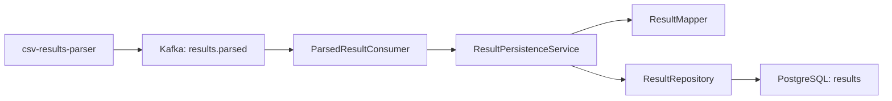
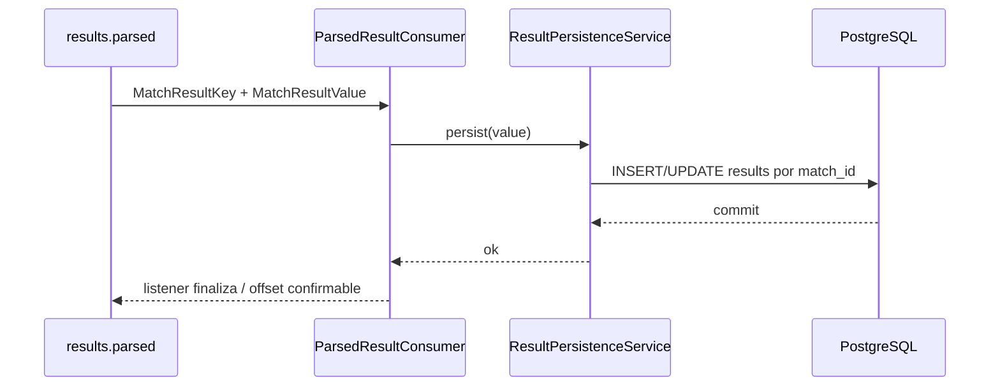

# Diagramas — csv-results-persistence

## Componentes

```mermaid
flowchart LR
    P["csv-results-parser"] --> K["Kafka: results.parsed"]
    K --> C["ParsedResultConsumer"]
    C --> S["ResultPersistenceService"]
    S --> M["ResultMapper"]
    S --> R["ResultRepository"]
    R --> PG["PostgreSQL: results"]
```

## Secuencia

```mermaid
sequenceDiagram
    participant K as results.parsed
    participant C as ParsedResultConsumer
    participant S as ResultPersistenceService
    participant DB as PostgreSQL

    K->>C: MatchResultKey + MatchResultValue
    C->>S: persist(value)
    S->>DB: INSERT/UPDATE results por match_id
    DB-->>S: commit
    S-->>C: ok
    C-->>K: listener finaliza / offset confirmable
```
