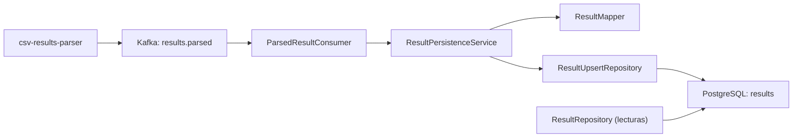
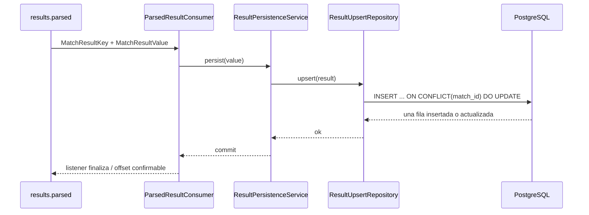

# Diagramas — csv-results-persistence

## Componentes

## Secuencia

La primary key `match_id` es la invariante de negocio que permite resolver redeliveries y reimportaciones en una única operación atómica. `source_event_id` conserva la trazabilidad de la importación que produjo el estado actual.
